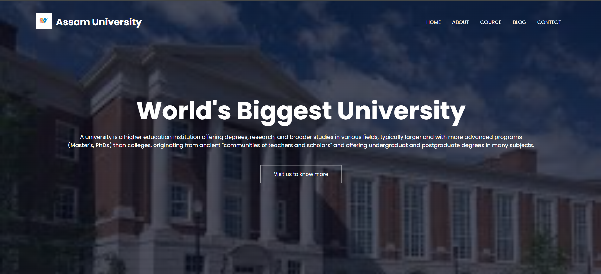
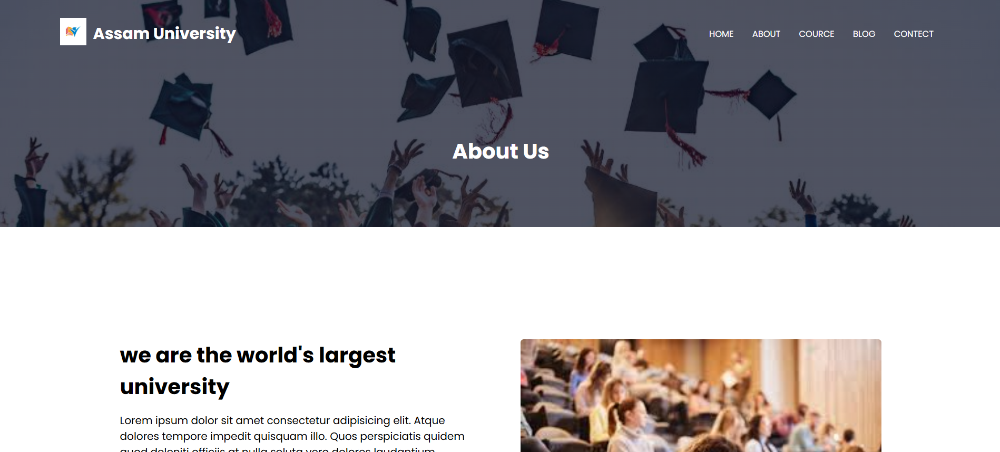

# 🎓 College Website (Responsive Static Web Project)

## 🌐 Live Demo

🔗 https://college-website-jet-delta.vercel.app

---

## 📌 Overview

This project is a **responsive college website** built using **HTML, CSS, and JavaScript**.
It is designed to represent a modern educational institution with a clean UI, smooth navigation, and mobile-friendly layout.

The website demonstrates front-end development skills including layout design, responsiveness, and basic interactivity.

---

## 🚀 Features

* 📱 Fully responsive design (Mobile, Tablet, Desktop)
* 🏫 Modern college-style UI layout
* 🧭 Smooth navigation across sections
* 🎨 Clean and structured styling using CSS
* ⚡ Basic JavaScript for interactivity
* 📄 Multiple sections (Home, About, Courses, Contact, etc.)

---

## 🛠️ Technologies Used

* **HTML5** – Structure of the website
* **CSS3** – Styling and responsiveness
* **JavaScript** – Basic functionality and interactivity

---

## 📂 Project Structure

```
college-website/
│── index.html
│── style.css
│── script.js
│── assets/
│   ├── images/
│   └── icons/
```

---

## 🎯 Purpose of the Project

* Practice responsive web design
* Improve UI/UX structuring skills
* Build a real-world static website
* Strengthen front-end fundamentals

---

## 📸 Screenshots
home page


about page


---

## ⚙️ How to Run Locally

1. Download or clone the repository
2. Open the project folder
3. Double-click on `index.html`

---

## 📈 Future Improvements

* Add backend integration (Node.js / Express)
* Implement dynamic data (MongoDB)
* Add login/signup functionality
* Enhance animations and UI

---

## 👨‍💻 Author

**Kranthi Kumar**

* MERN Stack Developer (Fresher)
* Passionate about building responsive and scalable web applications

---

## ⭐ Acknowledgment

This project was created as part of my learning journey in front-end and MERN stack development.

---

## 📬 Feedback

If you have any suggestions or feedback, feel free to connect!

---
